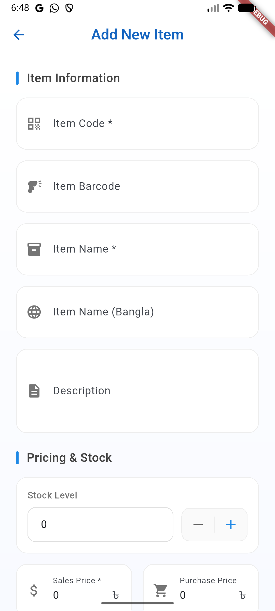
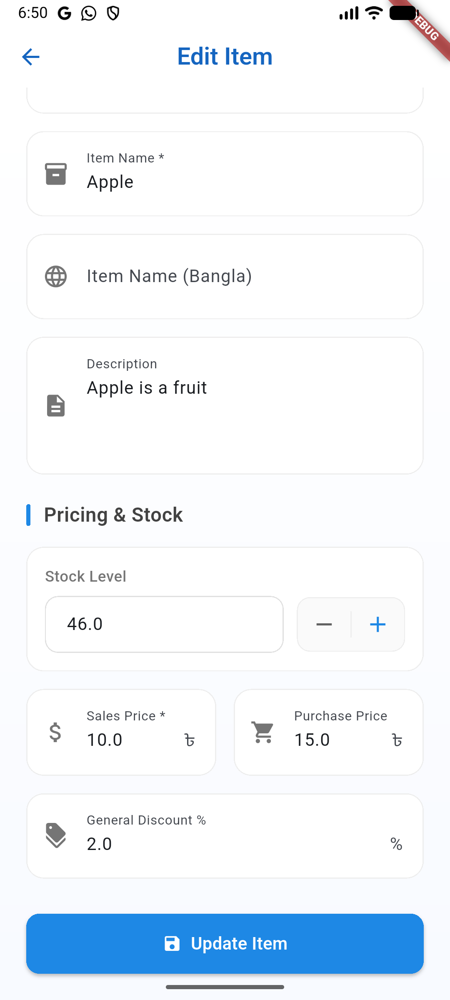

# External DB Test

A robust Flutter application demonstrating Clean Architecture principles, integrated with a Node.js backend and PostgreSQL database. This project showcases best practices for building scalable and maintainable mobile apps with external database connectivity.

## 🚀 Features

-   **Clean Architecture**: Separation of concerns with Domain, Data, and Presentation layers.
-   **State Management**: Powered by `flutter_bloc` for predictable state management.
-   **REST API Integration**: Seamless communication with a Node.js backend using `http`.
-   **CRUD Operations**: Full Create, Read, Update, and Delete functionality for items.
-   **External Database**: Data persistence using PostgreSQL.
-   **UI/UX**: Modern and responsive user interface.

## 📸 Screenshots

| Screenshot 1 | Screenshot 2 |
|-------------|--------------|
|  |  |

### More Screenshots



## 🛠️ Getting Started

Follow these steps to get a local copy up and running.

### Prerequisites

-   [Flutter SDK](https://flutter.dev/docs/get-started/install)
-   [Node.js](https://nodejs.org/) (for the backend)
-   [PostgreSQL](https://www.postgresql.org/) (for the database)

### Installation

1.  **Clone the repository**
    ```bash
    git clone https://github.com/yourusername/external_db_test.git
    cd external_db_test
    ```

2.  **Install Flutter dependencies**
    ```bash
    flutter pub get
    ```

3.  **Setup the Backend**
    -   Navigate to the backend directory or ensure your Node.js server is running.
    -   Update `lib/core/api_constants.dart` with your local IP address or server URL.
    -   Set up the PostgreSQL database and update the connection details in the backend.
    
    **Step 1: Create the Table**
    ```sql
    CREATE TABLE item_dtl
    (
        item_id               BIGINT GENERATED ALWAYS AS IDENTITY,
        item_code             VARCHAR(20),
        item_barcode          VARCHAR(50),
        item_name             VARCHAR(550) NOT NULL,
        item_name_bn          VARCHAR(400),
        item_des              VARCHAR(650),
        item_stock            NUMERIC(18,6) DEFAULT 0,
        item_sales_price      NUMERIC(18,6) DEFAULT 0,
        item_general_discount NUMERIC(18,6),
        item_pur_price        NUMERIC(18,6) DEFAULT 0,
        item_sell_cost_pct    NUMERIC(18,6) DEFAULT 15,
        CONSTRAINT item_dtl_pk PRIMARY KEY (item_id)
    );

    CREATE INDEX idx_item_dtl_item_code ON item_dtl(item_code);
    CREATE INDEX idx_item_dtl_item_name ON item_dtl(item_name);
    CREATE INDEX idx_item_dtl_item_barcode ON item_dtl(item_barcode);
    ```

    **Step 2: Insert Test Data**
    ```sql
    INSERT INTO item_dtl
    (
        item_code,
        item_barcode,
        item_name,
        item_name_bn,
        item_des,
        item_stock,
        item_sales_price,
        item_general_discount,
        item_pur_price
    )
    VALUES
    (
        'ITM001',
        '8901234567890',
        'Test Item',
        'টেস্ট আইটেম',
        'Sample item for PostgreSQL identity test',
        100.500,
        250.75,
        10.00,
        200.00
    );
    ```

4.  **Run the App**
    ```bash
    flutter run
    ```

## 📂 Project Structure

```
lib/
├── core/           # Core functionality (Constants, Failures, UseCases)
├── data/           # Data layer (Data Sources, Models, Repositories)
├── domain/         # Domain layer (Entities, Repositories Interfaces, UseCases)
├── presentation/   # Presentation layer (Blocs, Pages, Widgets)
└── main.dart       # Application entry point
```

## 🤝 Contributing

Contributions are welcome! Please feel free to submit a Pull Request.
